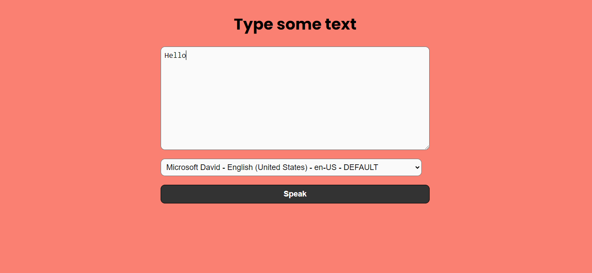

Sure! Here's a concise and engaging description for your text-to-speech app on GitHub:

---

# Text-to-Speech Application

A simple and intuitive text-to-speech web application that leverages the Web Speech API to convert written text into spoken words. This app allows users to select different voices and languages, making it a versatile tool for various applications such as accessibility, language learning, and personal productivity.

## Features

- **Voice Selection:** Choose from a variety of available voices and languages.
- **Text Input:** Enter any text you want to be read aloud.
- **Real-Time Synthesis:** Immediate speech output as you type.
- **User-Friendly Interface:** Easy-to-use design for seamless interaction.

## Getting Started

1. **Clone the Repository:** `git clone https://github.com/HopSoft-Tech/Speech-Synthesis-Text-to-Speech-.git`
2. **Open `index.html` in Your Browser:** No additional setup required.

## Usage

1. **Select a Voice:** Choose your preferred voice from the dropdown menu.
2. **Enter Text:** Type the text you want to be spoken into the input field.
3. **Press Submit:** Click the submit button to hear your text read aloud.

## Screenshot

## Contributing

Contributions are welcome! Please open an issue or submit a pull request with any improvements or bug fixes.

## License

This project is licensed under the MIT License.

